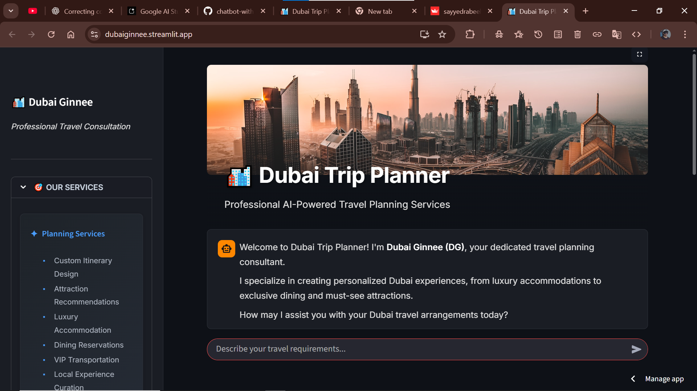
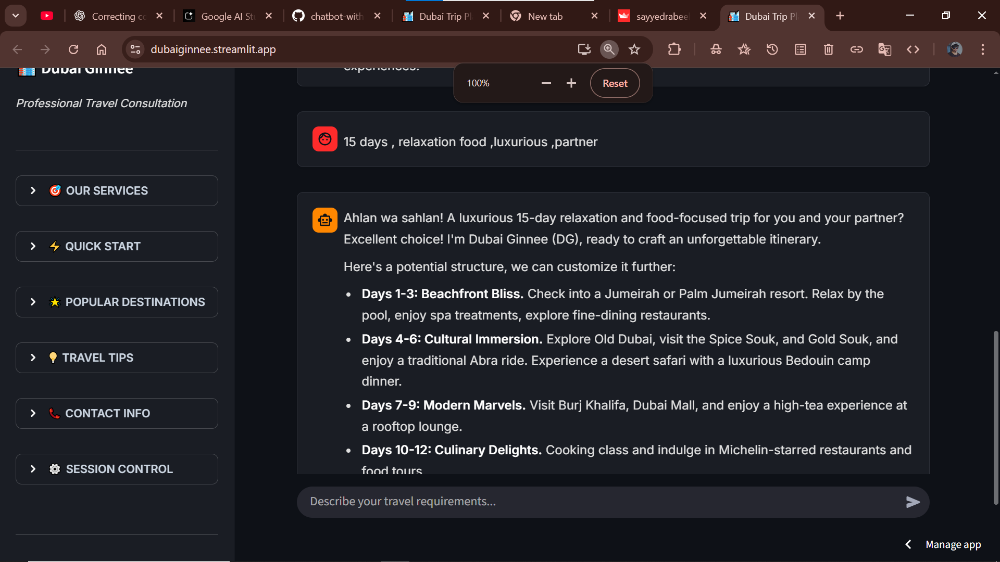

 
# DubaiTripPlanner — AI‑Powered Chatbot App  

[](https://dubaiginnee.streamlit.app/)

## 🏙️ Project Overview  
**DubaiTripPlanner** is a Streamlit‑based web app that leverages Google Gemini to act as **“Dubai Ginnee (DG)”**, a professional travel‑planner chatbot for Dubai.  
It helps users plan itineraries, get hotel/restaurant suggestions, attractions, and travel advice — all through a simple conversational UI.

>  Built with simplicity in mind: minimal setup, instant deployment, and intuitive chat-based interaction.

---

##  Features

- ✅ Chat-based UI for travel planning  
- ✅ Day-wise itinerary suggestions (leisure, business, mixed)  
- ✅ Hotel / dining / attraction recommendations  
- ✅ Quick‑start buttons (e.g. “3‑Day Trip”, “Hotels”, “Dining”, “Attractions”)  
- ✅ Dark‑mode professional styling for UI  
- ✅ Easy deployment on Streamlit Community Cloud  

---

##  Demo & Screenshots  

  
*Example chat-based itinerary planning flow*

  

👉 You can also try the live app [here](https://dubaiginnee.streamlit.app)

---

##  Installation & Setup (Local)  

```bash
git clone https://github.com/sayyedrabeeh/chatbot-with-streamlit.git  
cd chatbot-with-streamlit  

# create & activate virtualenv (optional but recommended)
python -m venv venv  
venv\Scripts\activate        # Windows  
source venv/bin/activate     # macOS / Linux

pip install -r requirements.txt  
````

Create a `.env` file at project root:

```text
GEMINI_API_KEY="your_new_api_key_here"
```

**Important:** Do *not* commit `.env` to GitHub — it contains your private API key.

To run locally:

```bash
streamlit run chatbot_withopenai.py
```

---

##  Deployment (Streamlit Community Cloud)

1. Push your code to GitHub
2. Ensure `.env` is excluded (via `.gitignore`)
3. On Streamlit Cloud → set `GEMINI_API_KEY` under **Secrets**
4. Deploy — the live badge at top links to your app

*[Why this matters? Because public/private environment variables keep your key safe.]* ([docs.streamlit.io][1])

---

## Project Structure

```
.
├── chatbot_withopenai.py    # Main Streamlit app  
├── requirements.txt  
├── .gitignore  
├── README.md                # ← this file  
└── (optional) assets/        # images/screenshots used in README or app  
```

---

 
```

 

[1]: https://docs.streamlit.io/deploy/streamlit-community-cloud/share-your-app?utm_source=chatgpt.com "Share your app - Streamlit Docs"
[2]: https://www.freecodecamp.org/news/how-to-write-a-good-readme-file/?utm_source=chatgpt.com "How to Write a Good README File for Your GitHub Project"
